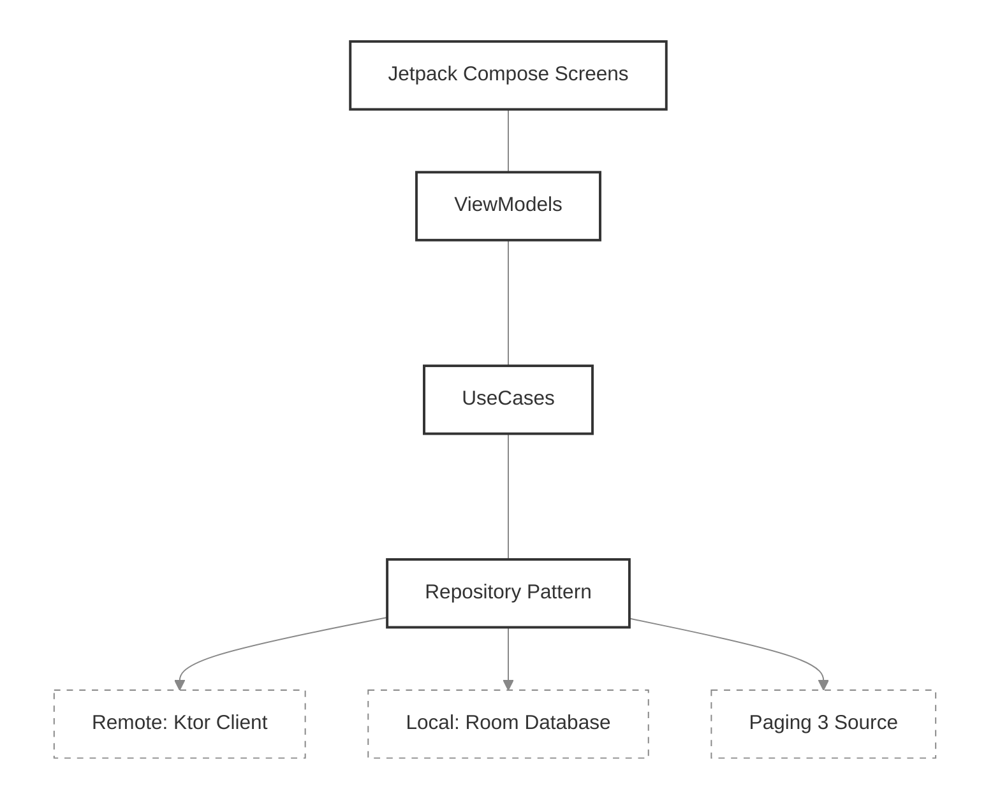

<div align="center">

# 🥗 Mama’s Kitchen — Advanced Recipe Discovery

**Mama’s Kitchen** is a high-performance Android application built to demonstrate the pinnacle of **Modern Android Development (MAD)**. It offers a refined, visual-first journey through world-class recipes, backed by a secure, offline-first technical foundation.


---

## 📱 Visual Highlights
> **Immersive Experience**: The interface was designed using **Material 3** principles, ensuring smooth transitions and a visual-first approach to recipe discovery with a consistent **60 FPS** performance.
<br />
<table border="0">
  <tr>
    <td align="center" valign="top" width="33%">
      <kbd>
        
      </kbd>
      <br/><br/>
      <b>Discovery & Home</b>
    </td>
    <td align="center" valign="top" width="33%">
      <kbd>
        
      </kbd>
      <br/><br/>
      <b>Advanced Search</b>
    </td>
    <td align="center" valign="top" width="33%">
      <kbd>
        
      </kbd>
      <br/><br/>
      <b>Recipe Details</b>
    </td>
  </tr>
</table>

---

## 📖 About the Project
> **Mama’s Kitchen** is a premium recipe discovery platform designed to showcase the integration of high-performance networking, hardware-level security, and a fluid, 100% declarative UI.
<details>
<summary><b>🔍 What is Mama's Kitchen? (Click to expand)</b></summary>
<br/>

Designed for the modern home cook, this application prioritizes **speed, accessibility, and intuitive interaction**. It serves as a technical benchmark for handling high-volume data from the **FatSecret API** while maintaining a consistent **60 FPS** experience.

The app addresses the need for a reliable kitchen companion by offering:
* **Visual-First Discovery**: A high-density feed optimized for food photography.
* **Lightning-Fast Search**: Advanced filtering with low-latency response times.
* **Secure Offline Mode**: Ensuring critical recipe data is available without internet access, protected by local encryption.

</details>

<details>
<summary><b>✨ View Core Features (Adaptive UI & Personalization) (Click to expand)</b></summary>
<br/>

| **Feature** | **Implementation** | **Benefit** |
| :--- | :--- | :--- |
| **Personal Favorites** | Room + SQLCipher | Secure, encrypted local recipe storage. |
| **Material You** | Dynamic Palette API | UI colors that adapt to recipe photography. |
| **Dark/Light Mode** | Theme-aware Composables | Optimized readability for any environment. |
| **Adaptive Layout** | Split-Pane / Landscape | Seamless experience on tablets and foldable devices. |

<br />

<div align="center">

| Personal Favorites | Dark/Light Mode | Adaptive Landscape |
|:---:|:---:|:---:|
|  |  |  |

</div>

</details>

---

## 🏗️ Deep Architecture

>The project is built on **Strict Clean Architecture** and **MVVM**, enforcing total separation of concerns and a predictable state management via **Unidirectional Data Flow (UDF)**.

## 🏗️ Architecture & Design Patterns
> The project strictly follows **Clean Architecture** and **SOLID** principles, ensuring that business logic is completely decoupled from Android frameworks and UI implementations.

<details>
<summary><b>📂 Project Structure & Feature-Layered Architecture (Click to expand) </b></summary>
<br />

The codebase is partitioned into clearly defined layers to maximize testability and scalability:

| Layer | Responsibility | Key Components |
| :--- | :--- | :--- |
| **`data/`** | Data source orchestration | **Paging 3**, **Ktor**, **Room + SQLCipher** |
| **`domain/`** | Business Logic (Pure Kotlin) | **UseCases**, Repository Interfaces, Models |
| **`presentation/`** | Declarative UI State | **Jetpack Compose**, **ViewModels**, `ScreenStatus` |
| **`di/`** | Dependency Injection | **Koin 4.1.1** Modules |
| **`util/`** | Infrastructure and Helpers | **CryptographyManager**, **NetworkTracker** |

</details>

<details>
<summary><b>📐 Technical Implementation Details (MAD Stack) (Click to expand)</b></summary>
<br />

### 🌐 Networking & Serialization
* **Ktor Client**: Native Kotlin multiplatform engine configured with `HttpClient(Android)`.
* **Kotlinx Serialization**: Reflection-free JSON parsing for superior performance.
* **Advanced Pipeline**: Custom implementation of interceptors for `Logging` and `DefaultRequest`.

</details>

---

## 🔐 Engineering Excellence
> This project implements rigorous security protocols and automated quality assurance to ensure data integrity and application stability, exceeding standard mobile development practices.

<details>
<summary><b>🛡️ Hardware-Level Security & Persistence (Click to expand) </b></summary>
<br />

The application implements a multi-layered security strategy to protect user data at rest:

* **Full Database Encryption**: The entire **Room Database** is encrypted using **SQLCipher**, preventing unauthorized access to the local recipe cache.
* **Android KeyStore HSM**: Cryptographic keys are generated and securely stored within the device's **Hardware Security Module**, ensuring they never leave the secure hardware.
* **Manual AES-CBC Encryption**: Custom `CryptographyManager` implementation using **AES/CBC/PKCS7Padding** for sensitive data stored as BLOBs.
* **Memory Management**: Integrated **LeakCanary** in debug builds to proactively monitor and eliminate memory leaks.

</details>

<details>
<summary><b>🧪 Testing Strategy (Quality Assurance) (Click to expand)</b></summary>
<br />

A robust testing suite ensures the reliability of core components without unnecessary overhead:

* **Security Testing (Instrumented)**: Dedicated `CryptographyManagerTest` to verify AES encryption/decryption and KeyStore integration on a real Android runtime.
* **Unit Testing**: Business logic and UseCases verified using **JUnit4** and **MockK** to ensure predictable behavior.
* **Reactive Flow Testing**: Validation of asynchronous data streams and `StateFlow` emissions using **Turbine**.

</details>

---

## 🛠️ Tech Stack & Tooling
> This project leverages a cutting-edge **Modern Android Development (MAD)** stack, prioritizing type-safety, reactive data streams, and hardware-accelerated performance.

<details>
<summary><b>🚀 Core Technologies & Libraries (Click to expand)</b></summary>
<br />

The application is built with a carefully selected suite of tools to ensure a scalable and maintainable codebase:

| Category | Technologies |
| :--- | :--- |
| **Language** | **Kotlin 2.2.20** (Latest features & Performance) |
| **UI Framework** | **Jetpack Compose** + Material 3 + Palette API |
| **Networking** | **Ktor Client** + Kotlinx Serialization |
| **Persistence** | **Room 2.8.3** + **SQLCipher** (Military-grade encryption) |
| **DI** | **Koin 4.1.1** (Lightweight Dependency Injection) |
| **Async & Flow** | Coroutines + Kotlin Flow + **Paging 3** |
| **Quality/CI** | GitHub Actions + **LeakCanary** + Timber |

</details>

---
## 🚀 Getting Started
> To ensure the application functions correctly, you must provide a valid API Key. This project uses a **secure properties injection** method to prevent sensitive credentials from being committed to version control.

<details>
<summary><b>🔑 API Configuration & Credentials (Click to expand)</b></summary>
<br />
<div align="center">

The application communicates with the **FatSecret Platform API** to fetch nutritional data and recipes. Follow these steps to set up your environment:

### 1. Obtain FatSecret Credentials
* Go to the [FatSecret Platform API](https://platform.fatsecret.com/api/) website.
* Register for a free developer account and navigate to the **My Apps** section.
* Create a new application to obtain your **Client ID** and **Client Secret**.

### 2. Configure Local Properties
Create a file named `key.properties` in your **root directory** (at the same level as your `build.gradle` and `settings.gradle` files). This file is ignored by Git for your security.

Add the following lines to the file:

```properties
CLIENT_ID = your_client_id_here
CLIENT_SECRET = your_client_secret_here
```

### 3. Build & Run
**Sync Project with Gradle Files**. The values will be injected via the generated `BuildConfig` class.

<br />
</details>

---

<div align="center">
  <br/>

  ><sub>Created and Engineered by</sub>
  
  <br/>

  **Giovanna Amatucci**
  <br />
  Android Software Engineer

  <p align="center">
    <i>"Specialized in designing and building high-performance, secure, and scalable applications."</i>
  </p>

  <p align="center">
    <a href="https://www.linkedin.com/in/giovanna-amatucci2001/">
      
    </a>
    &nbsp;
    <a href="https://github.com/GiovannaAmatucci">
      
    </a>
  </p>

  <br />

  `Clean Architecture` &bull; `Modern Android Development` &bull; `Security-Driven Engineering`

  <br />

  <sub>This project is a technical showcase of **architectural excellence**, **performance optimization**, and **hardware-level security**.</sub>

  <br />

  **© 2025 | Giovanna Amatucci**
  <br />
</div>
</div>
